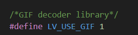

# 基于嵌入式系统与 LVGL 的 AI 桌面智能助手 

## 项目简介
这是一个基于 Orange Pi 5 Pro 嵌入式平台开发的智能 AI 桌面智能助手，集成了讯飞星火大模型，最强大的星火大模型（星火4.0 Turbo），在文本生成、语言理解、知识问答、逻辑推理、数学能力等七大维度全面超越GPT 4-Turbo，优化联网搜索链路，提供更精准回答。同时集成音乐播放和多媒体交互等功能，界面 UI 采用 LVGL 开发。

## 功能特点
- 支持智能语音交互（讯飞星火 Spark 4.0 Ultra 大模型）
- 多媒体控制功能（音乐播放等功能，待定）
- 自定义 UI 界面（基于 LVGL）
- 嵌入式环境下的高效资源管理
- 支持语音唤醒和语音识别功能

## 技术栈
- **嵌入式开发板**：Orange Pi 5 Pro
- **图形界面库**：LVGL v8.3.11
- **人工智能模型**：GPT
- **开发语言**：C/C++，Python

## 部署流程

### LVGL 部署

- **LVGL 版本**：LVGL v8.3.11
- **编程环境**：Windows 11 + VS Code
- **编译环境**：Ubuntu 20.04 (交叉编译)
- **测试平台**：Orange Pi 5 Pro
- **显示屏**：7 英寸 RGB 1024x800 分辨率

#### 1. 准备工作
   - 从 LVGL GitHub 主页下载以下三份代码：
      - `lv_port_linux_frame_buffer`
      - `lvgl` (v8.3.11)
      - `lv_drivers` (v8.3.11)
   - 或者直接下载本工程的完整代码

#### 2. 创建工程

   1. 创建一个名为 `lvgl_project` 的文件夹。
   2. 将下载的 `lvgl` 和 `lv_drivers` 文件夹复制到 `lvgl_project` 中。
   3. 将 `lv_port_linux_frame_buffer` 文件夹中的 `main.c` 和 `Makefile` 文件复制到 `lvgl_project` 中。
   4. 将 `lvgl` 文件夹中的 `lv_conf_template.h` 文件复制到 `lvgl_project` 并改名为 `lv_conf.h`。
   5. 将 `lv_drivers` 文件夹中的 `lv_drv_conf_template.h` 文件复制到 `lvgl_project` 并改名为 `lv_drv_conf.h`。

   > **注**：`lv_conf_template.h` 和 `lv_drv_conf_template.h` 为模板文件，后续若 LVGL 配置出现问题，可以重新替换这些模板文件。

#### 3. 修改配置文件

##### 修改 `lv_drv_conf.h`

- 将 `#if 0` 改为 `#if 1`：
  
  

- 将 `USE_FBDEV` 的值改为 `1`，使能 frame buffer 设备：
  
  
  
- 将 `USE_EVDEV` 的值改为 `1`，配置触控输入设备的文件路径：
   - 可使用evtest指令查看当前的触摸设备修改配置
   - 如果出现触摸设备无反应可进行触摸坐标校准，可在`evdev.c`文件中的`evdev_read()`这个函数中添加调试信息观察触摸事件是否正常触发

  
  
##### 修改 `lv_conf.h`

- 将 `#if 0` 改为 `#if 1`：
  
  
  
- 根据实际情况适当扩大内存配置：

  
  
- 这里可以修改刷新频率，默认为 30ms：

  
  
- 配置 Tick：

  
  
- 使能 widgets demo：

  

##### 修改 `Makefile`

- 指定编译器：若编译前已设置编译器环境变量，为避免错误，此处可以注释掉配置项并使用环境下的默认编译器。

  - 如未配置交叉编译环境，可参考以下资源：
     - [配置交叉编译环境](https://blog.csdn.net/m0_53809203/article/details/134236670)
     - [清华大学开源软件镜像站](https://mirrors.tuna.tsinghua.edu.cn/armbian-releases/_toolchain/?C=N&O=A)

  

- 添加 `lv_drivers.mk`，并注释掉鼠标样式源文件（如果后面需要使用鼠标需在文件夹中添加mouse_cursor_icon.c文件）：

  

##### 在lvgl_project文件夹下执行`make`指令编译代码生成可执行文件
- 在LVGL中显示GIF图像
    - 在lv_conf.h文件中使能`LV_USE_GIF`
       
         

    - 使用LVGL官方给出的图像格式在线转换网站将自己的GIF图像转化为c数组，选择“Raw”颜色格式和“C array”输出格式，该平台同时也支持png图像转换
    - [LVGL图像在线转换](https://lvgl.io/tools/imageconverter)
    - 如何使用转换后的c数组
      - 可以参照lvgl文件夹下`examples/libs/gif`文件夹下demo的使用方式
      - 下面是我自己参照demo后修改的`gif.c`文件
           ```bash
               #include "../../lv_examples.h"
               #if LV_USE_GIF && LV_BUILD_EXAMPLES

               lv_obj_t* gif_1(void) {
                   LV_IMG_DECLARE(SS); // 确保这里引用的是有效的 GIF 图像数据
                   lv_obj_t* img = lv_gif_create(lv_scr_act());

                   // 设置 GIF 源
                   lv_gif_set_src(img, &SS);
                   lv_img_set_zoom(img, 512);  // 设置缩放比例，256 表示 100%，512 表示 200%
                   lv_obj_align(img, LV_ALIGN_CENTER, 0, 0); // 居中对齐

                   // 确保对象可以接收点击事件
                   lv_obj_add_flag(img, LV_OBJ_FLAG_CLICKABLE);

                   // 设置背景颜色为白色
                   lv_obj_set_style_bg_color(img, lv_color_white(), 0); // 设置背景为白色
                   lv_obj_set_style_bg_opa(img, LV_OPA_COVER, 0);       // 设置背景不透明度

                   return img;
               }
           ```
      - LVGL提供了很多组件demo可以根据需求直接添加到自己的UI中具体的介绍和使用方式在下面的链接中
         - [LVGL中文开发手册](https://lvgl.100ask.net/8.1/index.html)
### LVGL 部署过程结束

### 星火大模型部署
- 前置条件需要在讯飞星火官网申请有权限的
   - app_id
   - api_key
   - api_secret
- URL/Domain配置请查看doc

- 运行测试脚本需要提前将 .env.example 拷贝为 .env并配置其中变量
#### 参照下面链接

- [讯飞星火大模型接入](https://github.com/iflytek/spark-ai-python)

### 星火大模型部署结束

### Snowboy语音唤醒功能部署

#### 参照下面链接

- [Snowboy语音唤醒功能](https://blog.csdn.net/crimaster1024/article/details/136821662)

### Snowboy语音唤醒功能部署结束

### sherpa-onnx语音识别与合成功能部署

#### 参照下面链接

- [sherpa-onnx语音识别功能部署](https://blog.csdn.net/anshichuxuezhe/article/details/132151456)
- [sherpa-onnx github](https://github.com/k2-fsa/sherpa-onnx)
