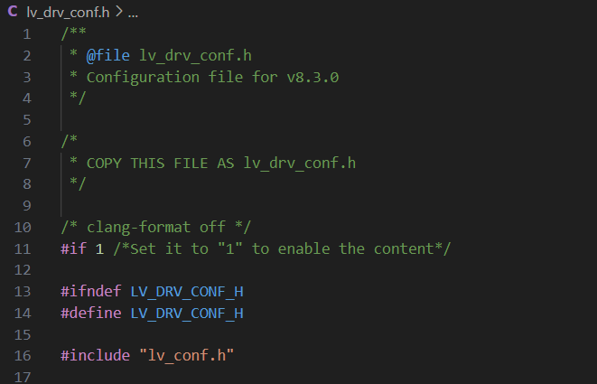
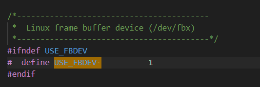
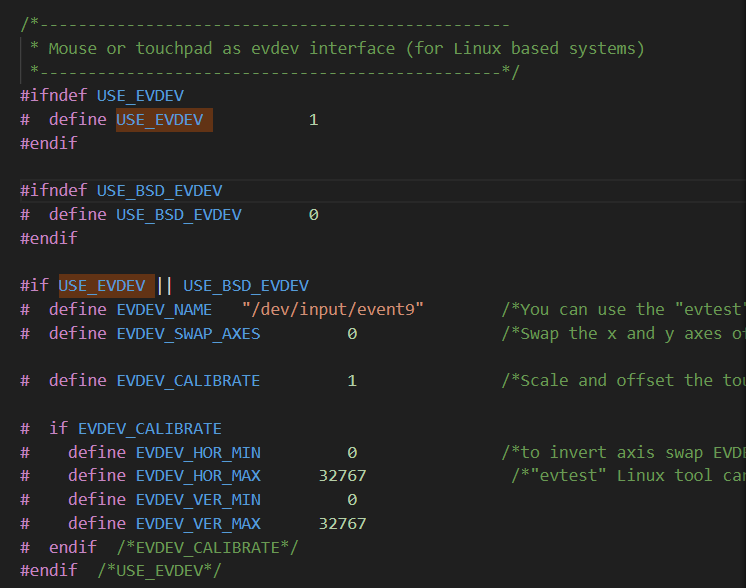
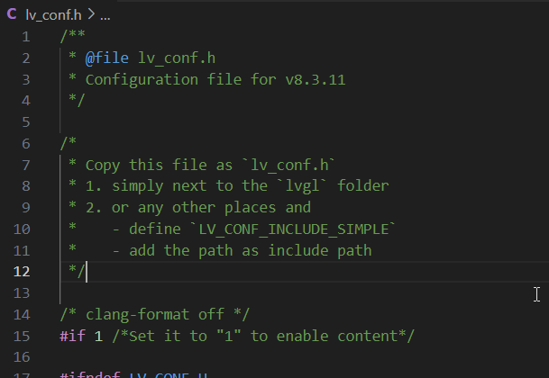
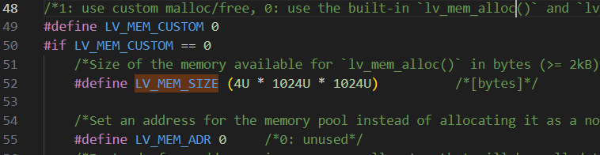
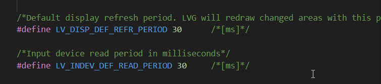
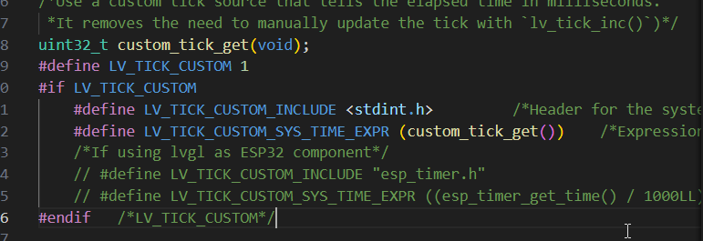
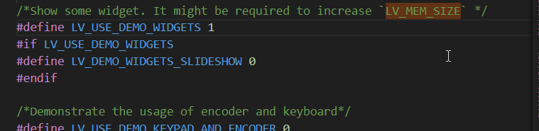
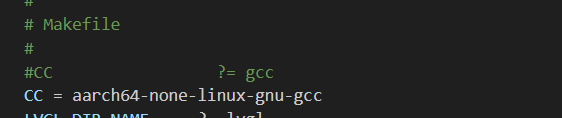
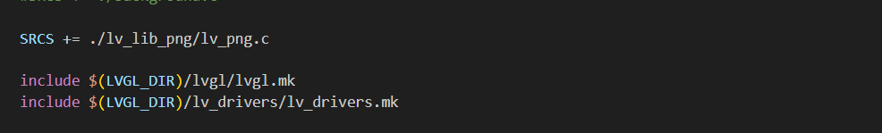

# 基于 LVGL 与嵌入式系统的 AI 助手 (未完成)

## 项目简介
这是一个基于 Orange Pi 5 Pro 嵌入式平台开发的智能 AI 助手，集成了 GPT 人工智能聊天功能、音乐播放和多媒体交互等功能。界面 UI 采用 LVGL 开发。

## 功能特点
- 支持智能语音交互（讯飞星火 Spark 4.0 Ultra 大模型）
- 多媒体控制功能（音乐播放等功能，待定）
- 自定义 UI 界面（基于 LVGL）
- 嵌入式环境下的高效资源管理
- 支持语音唤醒和语音识别功能

## 技术栈
- **嵌入式开发板**：Orange Pi 5 Pro
- **图形界面库**：LVGL v8.3.11
- **人工智能模型**：GPT
- **开发语言**：C/C++，Python

## 部署流程

### LVGL 部署
- **LVGL 版本**：LVGL v8.3.11
- **编程环境**：Windows 11 + VS Code
- **编译环境**：Ubuntu 20.04 (交叉编译)
- **测试平台**：Orange Pi 5 Pro
- **显示屏**：7 英寸 RGB 1024x800 分辨率

#### 1. 准备工作
   - 从 LVGL GitHub 主页下载以下三份代码：
      - `lv_port_linux_frame_buffer`
      - `lvgl` (v8.3.11)
      - `lv_drivers` (v8.3.11)
   - 或者直接下载本工程的完整代码

#### 2. 创建工程
   - 创建一个名为 `lvgl_project` 的文件夹
   - 将下载的 `lvgl` 和 `lv_drivers` 文件夹复制到 `lvgl_project` 中
   - 将 `lv_port_linux_frame_buffer` 文件夹中的 `main.c` 和 `Makefile` 文件复制到 `lvgl_project` 中
   - 将 `lvgl` 文件夹中的 `lv_conf_template.h` 文件复制到 `lvgl_project` 并改名为 `lv_conf.h`
   - 将 `lv_drivers` 文件夹中的 `lv_drv_conf_template.h` 文件复制到 `lvgl_project` 并改名为 `lv_drv_conf.h`
   
   > **注**：`lv_conf_template.h` 和 `lv_drv_conf_template.h` 为模板文件，后续若 LVGL 配置出现问题，可以重新替换这些模板文件。

#### 3. 修改配置文件

##### 修改 `lv_drv_conf.h`

将 `#if 0` 改为 `#if 1`：

   

将 USE_FBDEV 的值改为 1，使能 frame buffer 设备:

   
   
将 USE_EVDEV 的值改为 1，配置触控输入设备的文件路径：

   
   
##### 修改 `lv_conf.h`

将 #if 0 改成 #if 1：

   
   
根据实际情况适当扩大内存：

   
   
这里可以修改刷新频率，默认为 30ms：

   
   
配置 Tick：

   
   
使能 widgets demo：

   
   
##### 修改 `Makefile`
指定编译器，因为我在编译前会设置编译器环境变量，为避免错误，此处注释掉该配置，使用环境下默认编译器：
如果未配置交叉编译环境参照这份教程

- [配置交叉编译环境](https://blog.csdn.net/m0_53809203/article/details/134236670)
- [清华大学开源软件镜像站](https://mirrors.tuna.tsinghua.edu.cn/armbian-releases/_toolchain/?C=N&O=A)
  
   
  
添加 lv_drivers.mk，注释掉鼠标样式源文件：
   

